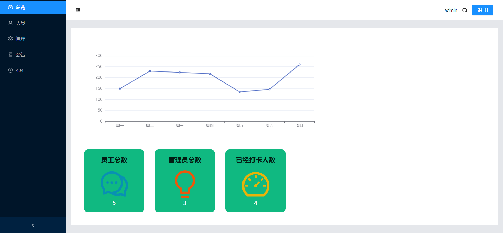

# 打卡记录后台管理系统

**使用 React+Koa 做的一个考勤打卡后台管理查看系统**

# Previews

登录

仪表盘

人员

管理员

404

目前使用到的技术栈

_前端_

1. React
2. Vite
3. TypeScript
4. WindiCSS
5. antd
6. echarts

_后端_

1. TypeScript
2. TypeORM
3. Koa

# 完成情况

1. 利用 JWT 和 Token 保存登录信息，鉴定登录时间
2. 员工和管理员的基本增删改查
3. 仪表盘情况总览

# TODO:

- [x] 对 axios 重新封装
- [x] 添加仪表盘界面以及后端的相应的 API
- [x] 添加权限不足的情况
- [ ] 添加错误处理的情况
- [x] 添加 token 过期的情况处理
- [ ] 做一个公告系统
- [x] 添加 README 照片
